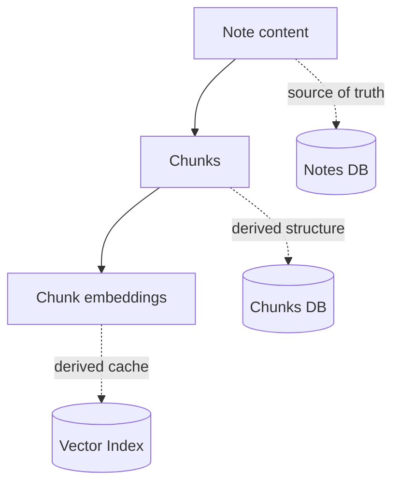
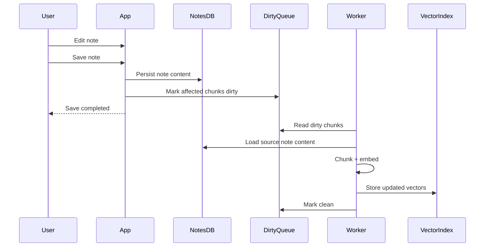
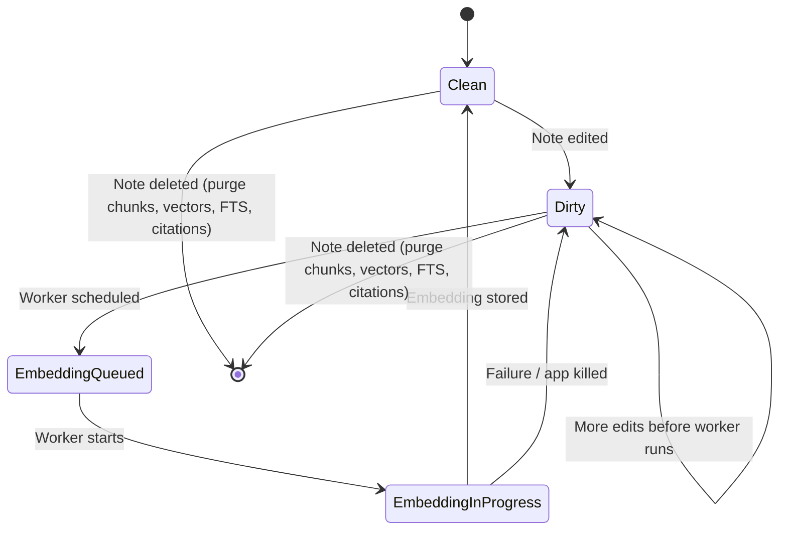
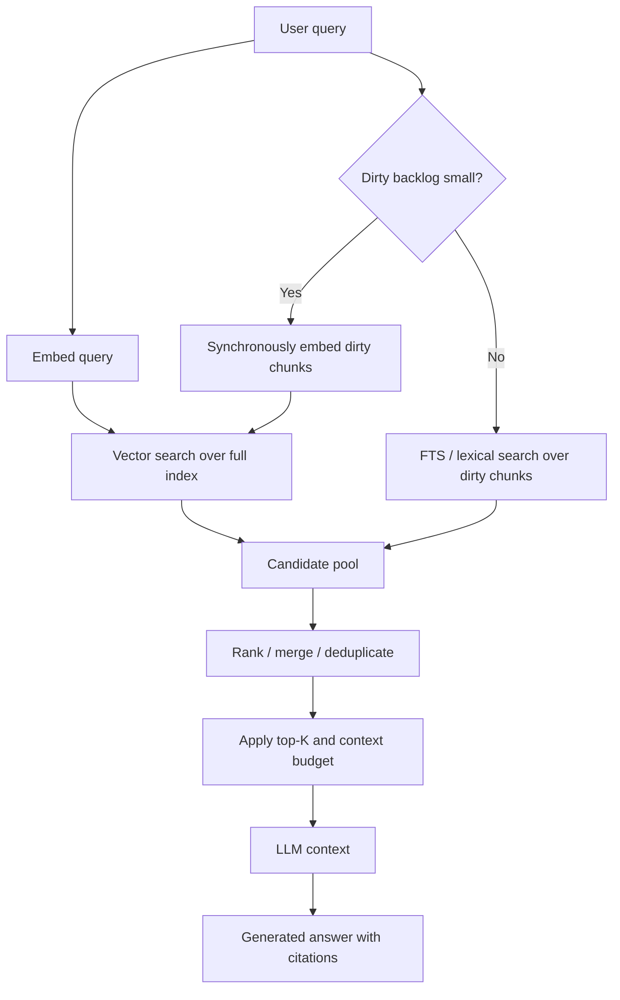
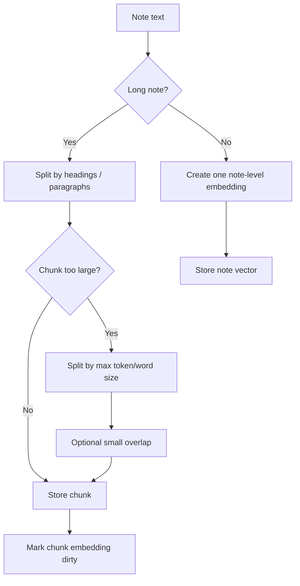
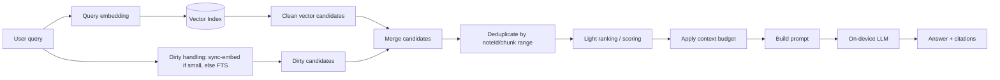
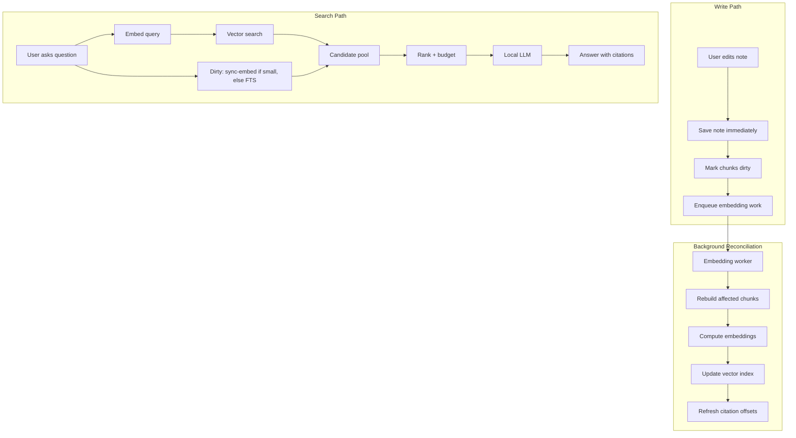

# Retrieval Layer Design — On-Device RAG-over-Notes

## Purpose

This document captures the current design decisions for the retrieval layer of an on-device RAG-over-notes application.

The main problem is not only how to retrieve relevant notes, but how to keep retrieval fresh when notes are mutable and embedding computation is expensive on mid-range hardware.

The key design tension:

```text
Fresh search results
vs
Fast note editing
vs
Low RAM / battery pressure
vs
Small, relevant LLM context
```

---

## Core Model

Notes are the source of truth. Chunks and embeddings are derived data.



### Invariant

```text
Notes are authoritative.
Chunks and embeddings may be stale, missing, or invalid.
The system must be able to reconcile derived data from notes.
```

---

## Decision 1: When to Recalculate Embeddings

### Rejected naive option: compute embeddings directly on save

Computing embeddings synchronously during save gives the freshest retrieval results, but couples a critical user action with expensive ML work.

Saving a note should be:

```text
cheap
reliable
fast
hard to lose
```

Computing embeddings is:

```text
expensive
can fail
can be retried
can be cached
not always immediately needed
```

So these two operations should not be part of the same critical path.

---

## Chosen Approach: Save + Mark Dirty + Background Reconciliation

When a note is saved, the app saves the note immediately and marks affected chunks or embeddings as dirty.

Embedding work is handled later by a background worker.



### Worker triggers

The worker should run under several conditions:

```text
1. After save, with debounce (collapse edit storms into one job)
2. While app is active and resources allow
3. Periodically as reconciliation safety net
4. After app restart, if dirty work remains
```

The periodic worker is not the primary mechanism. It is a recovery mechanism for failed, interrupted, or killed jobs.

---

## Cache Rule

Embedding is expensive and deterministic.

Therefore, if all inputs are the same, the result should be reused.

Cache key:

```text
chunkContentHash + embeddingModelVersion + chunkingVersion
```

Why hash the chunk content rather than key on `noteId + chunkIndex`?

Because `chunkIndex` is positional and fragile. Inserting a paragraph in the
middle of a note shifts the index of every following chunk, making all of them
look "changed" even though their text is identical — forcing needless
re-embedding of unchanged content.

Keying on the hash of the chunk's own text means an identical chunk reuses its
existing vector regardless of position shifts. Only chunks whose text actually
changed are recomputed. `chunkIndex` and `noteId` are still stored as metadata
(ordering, citation lookup), but they are NOT part of the cache key.

Why include `embeddingModelVersion`?

Because changing the embedding model invalidates old vectors (different vector space).

Why include `chunkingVersion`?

Because changing chunking strategy changes the input text ranges and therefore invalidates previous vectors.

---

## Dirty State Model



A dirty state is not an error. It means derived retrieval data is temporarily stale compared to the source note.

### Note deletion

On delete, the note's
derived data is purged directly: chunks, vectors, FTS entries, and any citation
offsets.

---

## Decision 2: Search Behavior with Dirty Notes

### Problem

If the user edits a note and immediately asks a question, stale vector search may miss the fresh note.

This is especially bad for the first-run experience:

```text
User writes first note
User asks about it immediately
App fails to retrieve it
```

That damages the core "magic moment" of the app.

### Conflict with the core RAG rationale

RAG was chosen here for a *quality* reason: retrieval acts as a semantic filter so
the weak on-device model is not drowned in long or irrelevant context. A purely
lexical (FTS) fallback for dirty notes contradicts that rationale, because FTS
misses synonyms — exactly the semantic matching RAG was supposed to provide.

Therefore the dirty-handling strategy must be sized by how much dirty work exists,
not fixed to FTS in all cases.

---

## Search Strategy

Dirty chunks should not automatically be inserted into the LLM context.

They should become candidates.

Final context must remain small and relevant.

```text
Dirty chunks are candidates, not automatic context.
```

### Chosen dirty-handling strategy: size-based hybrid

```text
If the dirty backlog is small (e.g. 1-3 notes / a few chunks):
    synchronously embed the dirty chunks before search
    -> preserves SEMANTIC freshness for the common case
       (user edits one note, then immediately asks about it)
    -> cost is one or a few embeddings (~tens of ms each)

Else (large backlog: big editing session, import):
    fall back to FTS (lexical) over dirty chunks
    -> cannot synchronously embed everything without bad latency
       and ill-timed model loading
    -> freshness is temporarily lexical until background reconciliation catches up
```

This is the previously-considered "re-embed only the dirty notes that matter"
(option C) for the common case, with FTS (option D) reserved as a fallback for
the heavy case only.

### Chosen search flow



### Why not always include all dirty chunks?

Because this can poison the LLM context.

RAG exists to keep context relevant. Passing all dirty chunks bypasses retrieval and can recreate the same problem RAG was meant to solve.

Bad case:

```text
User edits a long 5000-word note
Chunking produces 30 dirty chunks
User asks a narrow question
All 30 dirty chunks are inserted into context
The weak on-device LLM receives too much irrelevant text
Answer quality drops
```

### Bounded fallback rule

```text
If dirty chunks are few and fit a small context budget:
    synchronously embed them, let them compete as candidates
else:
    run FTS over dirty chunks and take only top matches
```

Dirty chunks should compete with vector results for the same final top-K/context budget.

They should not have unlimited privileged access to the prompt.

### Trade-off accepted (negative consequence)

```text
When the dirty backlog is large, freshly edited notes are searched lexically
(FTS) until the background worker finishes embedding them. Synonym / paraphrase
queries may miss those notes during that window. This is accepted because
synchronously embedding a large backlog at query time would cause unpredictable
latency and ill-timed model loading on mid-range hardware.
```

---

## Decision 3: Chunking Strategy — Open Hypothesis

Chunking is not locked as an MVP requirement yet.

The previous assumption was:

```text
long notes require chunking
```

This is directionally true, but it may be over-engineering for the first version. Many user notes may be short enough that one embedding per note is acceptable.

Important distinction:

```text
5000 characters ~ 700-1000 words
5000 words = long article-scale note
```

A 5000-character note is realistic and may still work with one vector. A 5000-word note is a stronger argument for chunking.

---

## Decision 4: Citation Granularity in the MVP

### Problem

Note-level embeddings (the MVP choice) return a whole note as the retrieval unit.
They do not know *which fragment* of the note was relevant. But the desired
citation experience is Level 2 — highlight the specific place in the note, not
just name the note (Level 1).

Note-level retrieval alone can only support Level 1.

### Chosen approach: hybrid highlight via in-note FTS (best-effort Level 2)

```text
1. Vector search finds the relevant NOTE (note-level embedding).
2. Run FTS for the query terms WITHIN that note to locate the matching span.
3. If a span is found -> Level 2 citation (highlight that paragraph/range).
4. If no span is found -> fall back to Level 1 citation (cite the whole note).
```

This reuses the FTS capability already needed for dirty-note search, so it adds
Level 2 citations without requiring chunk-level embeddings in the MVP.

### Trade-off accepted (negative consequence)

```text
Highlighting is best-effort. When the query matches a note semantically but uses
different words than the note's text (synonym/paraphrase), in-note FTS may find
no span, and the citation degrades to Level 1 (whole note). Precise paragraph
citation in that case requires chunk-level retrieval, which is deferred.
```

### Citation and cache-key coupling

Citation offsets (char ranges within a note) shift when text is inserted or
deleted. Because the embedding cache key is based on chunk content hash (not
position), unchanged chunks keep their vectors across edits — but their stored
offsets must still be refreshed when surrounding text shifts. Offset refresh is
part of reconciliation, separate from embedding recomputation.

---

## MVP Retrieval Scope

For MVP, the simpler baseline should be tested first:

```text
one note = one embedding
```

MVP behavior:

```text
On save:
    save note immediately
    mark note embedding dirty
    enqueue background embedding work

Search:
    embed query
    if dirty backlog small -> synchronously embed dirty notes first
    else -> FTS fallback over dirty notes
    vector search over note-level embeddings
    merge candidates, dedupe, rank
    apply shared context budget
    pass selected notes or excerpts to the LLM

Citation:
    vector search finds the note
    in-note FTS locates the span -> Level 2 highlight
    no span found -> Level 1 (whole note)
```

This avoids building a chunk-first retrieval layer before proving it is needed.

---

## Chunking as Conditional Optimization

Chunking should be introduced only if testing shows quality problems with note-level embeddings.

Possible trigger conditions:

```text
long notes are not found reliably
LLM answers become vague on long notes
specific facts inside long notes are missed
context becomes too large when full notes are passed to the LLM
citations need to point to precise paragraphs, not whole notes
```

Potential hybrid rule later:

```text
if note.length < threshold:
    one note = one vector
else:
    split into chunks
```

Example threshold to test:

```text
3000-5000 characters
```

This threshold is not a final architectural decision. It is an evaluation parameter.

---

## Risk: Small Model Behavior on Long Notes

The main reason to test chunking is not storage scale. It is small-model quality.

A small on-device LLM may behave poorly when given long or noisy context:

```text
lost-in-the-middle
semantic averaging
attention to irrelevant fresh text
mixing facts from different parts of a note
vague summaries instead of precise answers
```

Even if vector search finds the correct note, passing the whole note to the LLM may still reduce answer quality.

Example:

```text
A note mostly discusses work.
One small paragraph discusses taxes.

Query: "What did I write about taxes?"
```

Possible failures with note-level retrieval:

```text
the note vector represents the dominant work topic
the tax paragraph is not retrieved strongly
the whole note is passed to the LLM
the small model focuses on the dominant topic
answer becomes vague or misses the tax detail
```

This must be tested before implementing full chunking.

---

## Optional Chunking Flow

This flow is not required for the first MVP unless evaluation proves note-level retrieval is insufficient.



---

## Chunking Evaluation Plan

Compare these retrieval modes:

```text
A. one note = one vector, pass whole note
B. one note = one vector, pass extracted excerpt around keyword/FTS match
C. chunk-level embeddings for long notes only
D. chunk-level embeddings for all notes
```

Test cases:

```text
1. short note, direct question
2. medium note around 3000-5000 characters
3. long note with one small relevant paragraph
4. long note with several unrelated topics
5. synonym query where FTS may fail but semantic retrieval should work
```

Metrics:

```text
retrieval hit rate
answer correctness
answer specificity
context size
latency
RAM pressure
implementation complexity
```

Decision rule:

```text
Keep note-level embeddings for MVP unless tests show clear answer-quality loss on realistic notes.
Add chunking only where it improves final answer quality enough to justify complexity.
```

---

## Retrieval-to-Generation Flow



---

## Candidate Policy

The final LLM context should be built from a shared candidate pool:

```text
clean vector candidates
+ dirty candidates (semantic if sync-embedded, else lexical)
+ maybe recently edited small dirty chunks
```

All candidates must pass through:

```text
ranking
budgeting
deduplication
source tracking
```

No candidate source should bypass the final context budget.

---

## Context Poisoning Risk

Dirty fallback improves freshness but can reduce final answer quality if irrelevant chunks enter the prompt.

Risk:

```text
fresh dirty chunks may improve recall
but poison final context
```

Possible symptoms:

```text
model answers using irrelevant fresh notes
model mixes facts from unrelated chunks
model ignores better vector result
answer becomes vague or overlong
latency and memory usage increase
```

On-device models are especially sensitive to this because small quantized models handle noisy context worse than larger server-side models.

---

## Current MVP Decision

The MVP retrieval layer should start with note-level embeddings, not mandatory chunk-level embeddings.

```text
On save:
    save note immediately
    mark note embedding dirty
    enqueue background embedding work

Background worker:
    reconcile dirty notes with source notes
    compute note-level embeddings when resources allow
    update vector index
    refresh citation offsets when surrounding text shifted

Search:
    embed query
    small dirty backlog -> sync-embed dirty notes (semantic freshness)
    large dirty backlog -> FTS over dirty notes (lexical freshness)
    vector search over current note-level index
    merge candidates
    apply shared context budget
    send selected notes or excerpts to LLM

Citation:
    vector search finds the note
    in-note FTS locates the span -> Level 2 highlight, else Level 1

Chunking:
    not part of the first implementation by default
    evaluated as a quality optimization for long notes
    storage should not make future chunking impossible
```

---

## Final Design Summary



The key architectural principle:

```text
Do not make freshness free by poisoning context.
Freshness is useful only if retrieved context stays relevant.
```

The freshness principle:

```text
Keep freshness semantic when cheap (small backlog -> sync-embed).
Fall back to lexical freshness only under heavy backlog, and accept it explicitly.
```

The MVP principle:

```text
Start with note-level retrieval.
Keep chunking as a tested optimization, not an assumed requirement.
```