```mermaid
gantt
    title Dev phases vs Play release track
    dateFormat X
    axisFormat %s
    section Build
    Phase 0 de-risk models      :0, 1
    Phase 1 RAG slice           :1, 2
    Phase 2 persistence         :2, 3
    Phase 3 dirty reconcile     :3, 4
    Phase 4 fresh-edit search   :4, 5
    Phase 5 citations           :5, 6
    Phase 6 eval + chunking     :6, 7
    Phase 7 polish + listing    :7, 8
    section Play
    Account + ID verify         :0, 2
    Recruit 12 testers          :1, 3
    Closed testing 14-day timer :3, 6
    Production submit           :7, 8
```

# Development Plan — On-Device RAG-over-Notes

## Planning principle

Vertical slices, not horizontal layers. Each phase ships an artifact that **builds,
runs on a physical mid-range device, and is demonstrable in under a minute**. No
half-wired layers: every module added in a phase is actually exercised by the
running app.

Biggest risks are attacked first with the cheapest probe. The two killer risks here
are (1) the two models co-existing in RAM on a mid-range phone, and (2) acceptable
generation speed. Both are forced to the front.

```text
Definition of Done (every phase):
- Builds and runs on the real target device (mid-range, not flagship).
- The phase artifact is demonstrable in < 1 min.
- No half-wired layers; no dead modules.
- Memory + latency observed and written down (these are the project's whole point).
```

---

## Phase 0 — De-risk the models (mostly done, finish it)

**Goal:** prove the generation model AND the embedding model run, and crucially
that they **co-exist in RAM** on the real device.

**Artifact:** throwaway single-screen app (no architecture): load the LLM, generate
from a hardcoded prompt; load the embedder, embed a hardcoded string; print
tokens/sec, embedding latency, and peak RAM with **both models resident**.

**Why first:** Phase -1 already confirmed Gemma-4-E2B-it runs acceptably. The
remaining unknown is memory pressure with embedder + LLM loaded together — the
core feasibility question for RAG on mid hardware. If they don't fit together,
the whole architecture changes (e.g. load/unload models around each operation),
and that must be known now.

**Throwaway.** This code is deleted afterwards. Do not invest in structure.

```text
Exit criteria:
- Both models load and run on device.
- Peak RAM with both resident is known and survivable.
- Generation tokens/sec and embedding latency recorded.
```

---

## Phase 1 — Vertical slice: ask a question over hardcoded notes

**Goal:** end-to-end RAG over a tiny fixed set, no persistence, no gallery, no UI polish.

**Artifact:** Compose screen -> type a question -> get an LLM answer grounded in
~5 hardcoded notes. Embeddings computed in memory at launch. Retrieval = brute-force
cosine over 5 vectors (no vector DB yet). Prompt = query + top-K notes.

**Slices through:** embedder + LLM runner + a minimal retrieval function + prompt
builder + answer display. This is the first time the full RAG pipe runs as one flow.

**Deliberately NOT yet:** persistence, ObjectBox, real notes, dirty-state, FTS,
citations, background work.

```text
Exit criteria:
- Typing a question returns an answer that demonstrably uses the right note.
- The retrieve -> prompt -> generate path works as one call chain.
```

---

## Phase 2 — Real notes + persistence

**Goal:** real editable notes stored on device; search reads from a persistent index.

**Artifact:** create/edit/delete notes (simple Compose list + editor). On save,
note is embedded (synchronously for now — simplest correct version) and stored in
ObjectBox. Ask a question -> vector search over the persistent index -> answer.
Survives app restart without recomputing.

**Slices through:** notes store, ObjectBox vector index, note CRUD UI.

**Deliberately simplistic:** embed-on-save synchronously here. We KNOW from the
design this is wrong long-term (couples save to expensive ML), but it is the
simplest thing that fully works, and Phase 3 fixes it. Shipping a working naive
version beats a half-built correct one.

```text
Exit criteria:
- Notes persist; embeddings persist; search works after restart.
- The naive synchronous-embed path is functional end to end.
```

---

## Phase 3 — Decouple embedding: dirty-state + background reconciliation

**Goal:** remove expensive ML from the save path; make indexing incremental and
recoverable. This is where the real design (ADR-equivalent Decision 1) lands.

**Artifact:** save now persists the note and marks it dirty instantly; a background
worker embeds dirty notes under resource constraints; dirty-state machine
(Clean/Dirty/Queued/InProgress + delete purge); cache key on chunk-content-hash +
model version. Save is now instant regardless of model state.

**Slices through:** dirty queue, WorkManager worker, reconciliation logic, cache keying.

```text
Exit criteria:
- Save is instant and never blocks on the model.
- Killing the app mid-embed leaves work dirty and it resumes later.
- Editing the same note repeatedly collapses into one embed job (debounce).
```

---

## Phase 4 — Fresh-edit search: hybrid dirty handling + FTS

**Goal:** fix the "edit a note, immediately ask, it's not found" gap (Decision 2).

**Artifact:** search now handles dirty notes by the size-based hybrid — small
backlog: synchronously embed dirty notes before searching (semantic freshness);
large backlog: FTS fallback over dirty notes (lexical freshness). Candidates from
both sources merge into one pool, dedupe, rank, apply context budget.

**Slices through:** FTS index (SQLite FTS5), candidate merge/rank/budget, the
size-based branch.

```text
Exit criteria:
- Write a new note, immediately ask about it -> found (semantically, small backlog).
- A large editing session degrades gracefully to lexical freshness, not failure.
- No candidate source bypasses the final context budget.
```

---

## Phase 5 — Citations

**Goal:** every answer points to its sources; build trust against a weak model's
hallucinations (Decision 4).

**Artifact:** answers show source notes. Vector search finds the note; in-note FTS
locates the matching span -> Level 2 highlight; no span -> Level 1 (whole note).
Tapping a citation opens the note at the highlighted place.

**Slices through:** in-note FTS span lookup, citation offset storage + refresh on
edit, citation UI.

```text
Exit criteria:
- Answers cite real source notes.
- Where the query words appear in the note, the exact span is highlighted.
- Citations survive edits (offsets refreshed during reconciliation).
```

---

## Phase 6 — Quality evaluation + conditional chunking

**Goal:** decide empirically whether chunking is needed (Decision 3) — do not build
it on assumption.

**Artifact:** a small manual eval set (the test cases from the design doc: short
note, medium note, long note with one relevant paragraph, multi-topic note,
synonym query). Run retrieval modes A/B/C/D, record hit rate, answer correctness/
specificity, context size, latency, RAM. **Only if** note-level retrieval clearly
loses on realistic long notes, implement the length-thresholded chunking path.

**Slices through:** eval harness; conditionally, the structural-chunking pipeline.

```text
Exit criteria:
- A documented eval comparing note-level vs chunk-level on realistic notes.
- A defensible decision: chunking added where it earns its complexity, or
  explicitly deferred with evidence.
```

---

## Phase 7 — Polish for portfolio + Play release

**Goal:** make it demo-able, screenshot-worthy, and shippable.

**Artifact:** model-download/first-run flow, loading/empty/error states, streaming
token output in the UI, surfaced metrics (index status, query latency, RAM),
README with architecture Mermaid diagrams + the design doc, demo GIF, privacy
policy (required — app reads user notes), Play Store listing assets.

```text
Exit criteria:
- A stranger can install, add notes, ask a question, and see cited answers.
- README + design doc tell the architecture story without you present.
```

---

## Parallel track — Google Play release (runs alongside, NOT a final phase)

This is passive/bureaucratic time and must not sit on the critical path.

```text
Start during Phase 0-1:
    register Play developer account, pay one-time $25 (real debit/credit card)
    complete identity verification (hours to ~2 business days)
    begin lining up 12 testers (friends, D&D group, communities)

Start closed testing at end of Phase 2:
    upload the first persistent working build to a closed track
    12 testers must keep it installed 14 consecutive days
    the 14-day timer runs WHILE you build Phases 3-6

Apply for production at Phase 7:
    by now the test period has elapsed; release is not a blocker
```



---

## What ships when (artifact at each gate)

```text
Phase 0 -> proof both models fit in RAM and run (throwaway)
Phase 1 -> ask a question over 5 hardcoded notes, get a grounded answer
Phase 2 -> real persistent notes, search survives restart (naive sync embed)
Phase 3 -> instant saves, background incremental embedding, recoverable
Phase 4 -> freshly edited notes are found immediately
Phase 5 -> answers cite and highlight their sources
Phase 6 -> evidence-based decision on chunking
Phase 7 -> installable, demoable, listed; portfolio-ready
```

## Sequencing rationale

```text
- Models de-risked before any architecture (memory is the killer risk).
- A full RAG slice (Phase 1) before persistence, so the hard ML path is proven
  while everything else is trivial.
- Naive correct version (Phase 2) before the real decoupled design (Phase 3):
  always have something that fully works.
- Freshness (4) and citations (5) build on a stable index, not before it exists.
- Chunking last and conditional: never built on assumption, only on evidence.
- Play track runs in parallel; its 14-day wait overlaps build time.
```